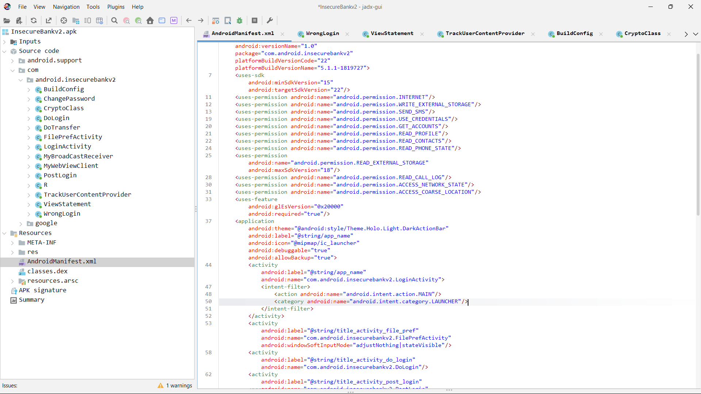

# Finding: Hardcoded Network Endpoints

## Summary
The application contains hardcoded backend API endpoints embedded directly in the client-side source code.

## Evidence
- Identified during static analysis using JADX.
- Network URLs are present as string literals in the source code.

## Details
- Affected Component: Client-side Java classes
- Endpoint Type: Backend API URL
- Transport Protocol: HTTP (unencrypted)
- Endpoint Location: Hardcoded within application logic

## Security Impact
- Any user can extract backend endpoint details by decompiling the APK.
- Enables attackers to directly target backend APIs without interacting with the mobile app.
- Increases exposure to automated attacks, replay attacks, and backend enumeration.

## Root Cause
- Backend configuration data is embedded directly in the client application.
- No abstraction or secure configuration mechanism is used.

## Status
- Confirmed via static analysis
