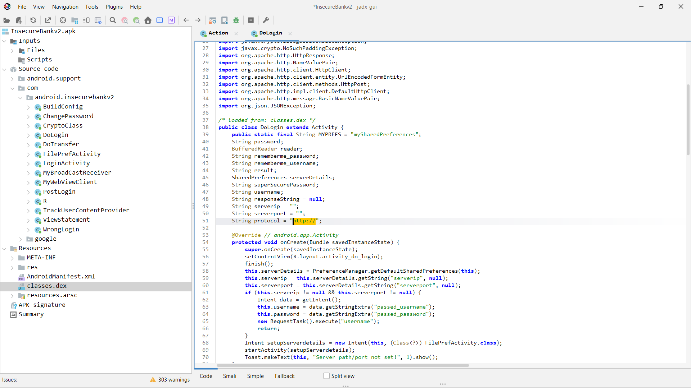

# Finding: Insecure Network Communication

## Summary
The application communicates with backend services over unencrypted HTTP rather than HTTPS.

## Evidence
- Hardcoded API endpoints use the HTTP protocol.
- No evidence of TLS configuration observed in client code.

## Details
- Transport Layer Security: Not implemented
- Certificate Pinning: Not present
- Data in Transit: Sent in plaintext

## Security Impact
- Credentials and sensitive data may be intercepted via man-in-the-middle attacks.
- Attackers on the same network can observe or modify traffic.
- Violates basic secure communication requirements for financial applications.

## Root Cause
- Absence of TLS enforcement in client-server communication.
- Lack of secure network configuration in application design.

## Status
- Confirmed via static analysis
