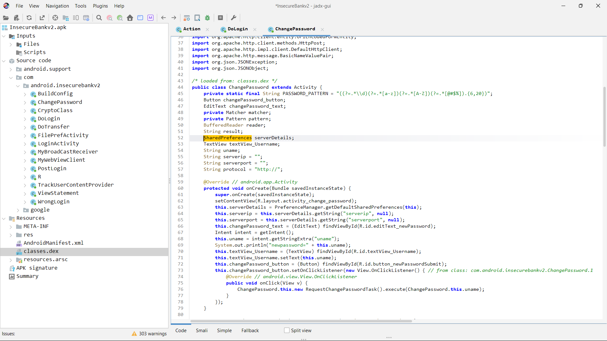

# Finding: Insecure Local Storage Usage

## Summary
The application makes use of local storage mechanisms that may store sensitive data on the device.

## Evidence
- References to SharedPreferences and/or local storage APIs found during static analysis.
- No evidence of encryption applied to locally stored values.

## Details
- Storage Mechanism: SharedPreferences / Local storage APIs
- Encryption: Not observed
- Access Scope: Application sandbox

## Security Impact
- Sensitive data may be accessible on rooted devices.
- Data extraction possible via backup, malware, or physical access.
- Increases risk of credential or session leakage.

## Root Cause
- Sensitive information is stored without encryption.
- Android Keystore is not utilized.

## Status
- Identified via static analysis
