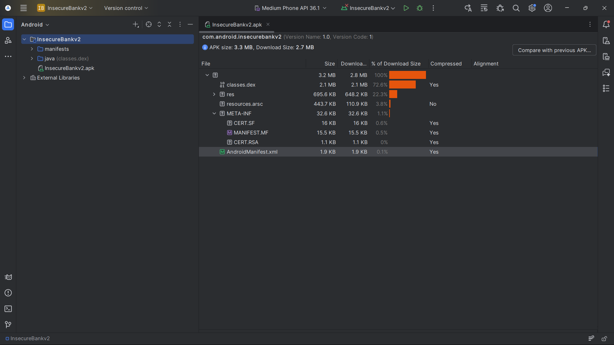

# APK Details — InsecureBankv2

## Basic Information
- App Name: InsecureBankv2
- Package Name: com.android.insecurebankv2
- Version Name: 1.0
- Version Code: 1

## APK Characteristics
- APK Size: ~3.3 MB
- DEX Files: Single (classes.dex)
- Obfuscation: None observed (no ProGuard/R8 indicators)
- Compression: Standard APK compression

## Platform Information
- Min SDK Version: (to be confirmed via aapt/JADX)
- Target SDK Version: (to be confirmed via aapt/JADX)

## Initial Observations
- Application is small and minimally protected.
- Single DEX suggests simpler reverse engineering.
- APK is suitable for static and dynamic analysis without heavy tooling overhead.

> Note: This file intentionally contains no security conclusions.

